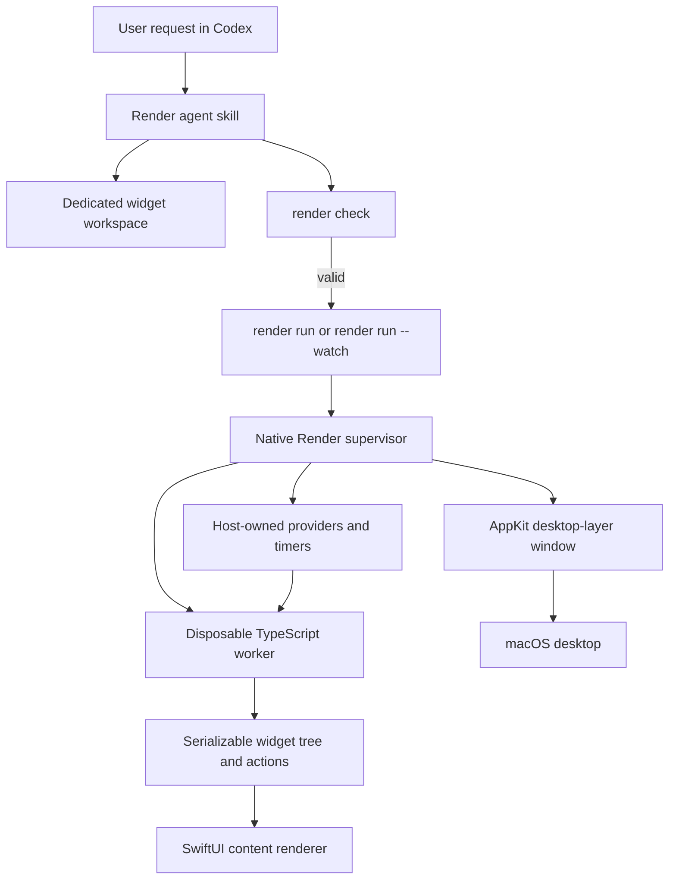

# Render ImplementationDoc

## Status

Implementation roadmap for the first Render prototype. The product and architecture decisions in this document were confirmed before implementation began.

The decision map is recorded in the closed [Render: first local macOS widget foundation](https://github.com/SamarthaB10/Render/issues/1) issue and its linked tickets.

## Destination

Build a local macOS experience where a user asks an agent to create any useful native widget, the widget appears directly on the desktop, and the user can remix it conversationally without manually editing code.

### North-star use case

The CPU/RAM monitor is the first vertical proof of the platform, not the destination. The product goal is that a user can ask:

> I need a mini 4x4 widget that plays my Spotify music.

Render should enable the agent to understand that request, choose canonical SDK primitives, declare the required network and account capabilities, ask for permission only when needed, connect to an authenticated provider/action integration, generate the declarative widget, launch it on the desktop, and keep it live. The resulting widget must support interaction, placement, remixing, persistence, and rollback.

Spotify should be one provider integration—not a special-case widget. The agent boundary, SDK, capability model, native renderer, provider/action contract, and lifecycle must remain general enough for other agent-generated widgets.

The first proof is:

1. Ask Codex for a CPU/RAM monitor.
2. The agent creates or updates a dedicated widget workspace.
3. The native macOS runtime renders the widget at the top-left of the primary display.
4. CPU and RAM values update once per second.
5. The widget persists and relaunches after macOS login.
6. Ask Codex to make it blue; the widget updates in place.
7. Ask Codex to move it to the top-right; the widget moves using a logical anchor.
8. Introduce a failing remix; the last-known-good widget remains running.

## Product contract

### User experience

- Codex or another coding agent is the primary interface.
- The user does not need to operate a separate builder UI.
- Generated code runs automatically after the agent updates the workspace.
- The first prototype retains its original one-widget workspace-scoped path;
  the completed F1 fleet lifecycle now supports explicit multi-workspace
  run/status/logs/stop/relaunch orchestration under a detached supervisor.
- Remixing updates that widget in place rather than creating a second widget.
- The user can drag the generated first-prototype widget, and its screen placement persists.
- A widget may declare host-owned adjustable sizing. Native resize handles, lock state, responsive mode selection, and size preferences persist separately from widget source.
- Stateful surfaces use host-owned SDK primitives. `Timer` persists countdown state and provides start/pause/reset controls; `TaskList` persists editable task rows and provides completion, add, remove, and direct text editing.
- The widget is a true desktop-layer surface, not a browser or ordinary floating app window.

### First prototype scope

- Native macOS rendering.
- One CPU/RAM widget.
- CPU/RAM is the first reference fixture; the platform must not be hard-coded around system metrics.
- Local CPU/RAM and current-time providers.
- TypeScript/TSX authoring.
- A canonical `@render/sdk`.
- A deterministic local `render` CLI.
- A Render agent skill that turns natural-language requests into source edits and CLI operations.
- A dedicated local widget workspace.
- Persistent active-widget registration and relaunch.
- Immutable Render snapshots and last-known-good rollback.
- Capability declarations and permission prompts for future resource access.

### Explicitly deferred

- MCP and XPC. The first prototype uses the local CLI and agent skill. MCP may later wrap the stable CLI contract if broader agent interoperability requires it.
- Multiple simultaneous widgets.
- Separate widget worker processes in the first prototype.
- Sharing, publishing, galleries, and marketplace workflows.
- iPhone and iPad support.
- Third-party API execution in the first CPU/RAM proof. The generic account requirement and Spotify connector now have host authorization and playback execution; a local Spotify client ID and user consent are still required for live account data.
- Editing unrelated user projects.
- Developer ID notarization, installer, updater, and App Store distribution.

## Non-negotiable project principles

See [AGENTS.md](AGENTS.md) for the complete guidance. The implementation must preserve these principles:

- Performance is part of the product. Memory and CPU usage are not polish work.
- Every numeric limit needs a measurement receipt before it becomes an enforced tripwire.
- Capacity should be generous until real usage is measured.
- APIs and errors must be useful to both a human and an agent.
- A budget failure must name the budget, the limit, and the observed ask.
- Prefer the obvious solution and refuse work the product does not need yet.
- Keep architecture boundaries simple and explicit.

## Architecture



### Agent boundary

The first agent boundary is a local CLI plus an agent skill:

- The agent skill interprets the user's natural-language request.
- The agent edits `widget.tsx` and related workspace files.
- `render check` validates the candidate without mutating the running widget.
- `render run` ensures the native host is running and returns when the widget is live.
- `render run --watch` observes source changes and hot-reloads successful candidates.
- `render status`, `render move`, and `render rollback` expose deterministic lifecycle operations.
- The native host is the supervisor; widget source executes in a disposable worker process.
- `render status --json` includes worker protocol, process, restart, resource, and diagnostic state.
- Human-readable output is the default.
- `--json` is the stable machine-readable contract for agents.
- MCP is not part of this first boundary.

### Native host boundary

The native macOS host owns:

- Native windows and desktop-layer behavior.
- SwiftUI rendering of declarative content.
- AppKit window configuration, placement, Spaces behavior, click-through, and interaction mode.
- Host-owned providers and timer scheduling.
- Capability enforcement and permission prompts.
- Active widget registration and relaunch.
- Candidate validation, promotion, rollback, and diagnostics.

Generated widget code does not own native windows and does not access arbitrary native APIs.

### TypeScript execution boundary

- TypeScript is the authoring format.
- The worker transpiles TypeScript locally to JavaScript.
- The worker executes the generated JavaScript in a disposable Node runtime.
- Widget code returns a serializable, platform-neutral declarative tree.
- Events emit serializable action messages rather than arbitrary serialized closures.
- The worker has no native window ownership; the supervisor owns the desktop surface.

### Supervisor and worker boundary (Phase 8)

The first prototype now runs one active widget through the same boundary required for later multi-widget isolation:

- A native supervisor owns lifecycle, windows, providers, permissions, identity, placement, rollback, restart policy, and compatibility.
- Each widget worker executes TypeScript and emits serialized trees and actions.
- Workers never own native macOS windows or unrestricted native resources.
- Workers are disposable and independently restartable from the last-known-good snapshot.
- Supervisor-worker communication uses a versioned protocol with compatibility negotiation.
- Worker CPU and resident memory are sampled by the supervisor and enforced only through measured tripwires.
- A worker failure leaves the current native tree in place while the supervisor retries with bounded exponential backoff.
- Session-specific worker state and tree files prevent a candidate supervisor from overwriting the active supervisor's state.

See [docs/phase8-supervision.md](docs/phase8-supervision.md) for the message contract, recovery states, and measured receipt.

## Workspace and source contract

The widget workspace is the durable source of truth. The first implementation should keep the layout obvious:

```text
<widget-workspace>/
  widget.tsx             # canonical authored entrypoint
  .render/
    metadata/            # workspace and SDK metadata
    snapshots/           # immutable candidate and known-good snapshots
    logs/                # runtime and validation diagnostics
    runtime/             # local runtime state that belongs to this workspace
```

The exact metadata filenames may be chosen during implementation, but durable widget state must not be hidden in a global directory. App Support may contain only global runtime metadata such as the active-workspace pointer, process state, and connection state.

### Manifest shape

The manifest lives in the TypeScript entrypoint through a wrapper similar to:

```tsx
import { widget, Column, Text, useProvider, useTimer } from "@render/sdk";

export default widget(
  {
    schemaVersion: 1,
    name: "System Monitor",
    sdkVersion: "...",
    size: { width: 320, height: 180 },
    anchor: { corner: "top-left", offset: { x: 24, y: 24 } },
    capabilities: [],
    subscribe: ["system.cpu", "system.memory"],
  },
  () => {
    // Return the declarative widget tree here.
  },
);
```

Authenticated widgets extend the JSON-compatible manifest with an explicit
connector requirement. This is a declaration, not a token container:

```tsx
"accounts": [{
  "connector": "spotify",
  "scopes": [
    "user-read-private",
    "user-read-playback-state",
    "user-read-currently-playing",
    "user-modify-playback-state"
  ]
}]
```

The current branch validates this contract and exposes it through the SDK
catalog. Spotify authorization and playback execution are intentionally not
called implemented until the native host owns the full lifecycle.

### Phase 10 source contract

The supplied Spotify OpenAPI document is used to cross-check endpoint paths,
operation IDs, request parameters, response status codes, and required scopes.
The authoritative provider documentation is:

- [Authorization Code with PKCE](https://developer.spotify.com/documentation/web-api/tutorials/code-pkce-flow)
- [Spotify scopes](https://developer.spotify.com/documentation/web-api/concepts/scopes)
- [Get Playback State](https://developer.spotify.com/documentation/web-api/reference/get-information-about-the-users-current-playback)
- [Start/Resume Playback](https://developer.spotify.com/documentation/web-api/reference/start-a-users-playback)
- [Pause Playback](https://developer.spotify.com/documentation/web-api/reference/pause-a-users-playback)
- [Set Playback Volume](https://developer.spotify.com/documentation/web-api/reference/set-volume-for-users-playback)

The first connector slice is limited to current playback, current track,
play/pause, previous/next, and volume. RenderHost must keep access and refresh
tokens out of widget workers, trees, logs, and agent-visible diagnostics.

The exact public API is finalized by the SDK implementation, but these rules are fixed:

- `schemaVersion` is required.
- `sdkVersion` is locked and checked for compatibility.
- `name` is human-facing identity.
- `size` is required.
- `adjustable` is optional. When enabled, it may declare `minSize`, `maxSize`, and named responsive modes with a default mode.
- `anchor` defaults to the top-left of the primary display.
- The runtime, not the agent, generates the stable `widgetId`.
- Capabilities are explicit and fine-grained, such as `network`, `filesystem.read`, and `filesystem.write`.
- Provider subscriptions are explicit.
- Unknown or malformed fields fail `render check` with source locations.

## Render SDK

`@render/sdk` is the canonical source of truth for primitives, providers, styles, actions, and capability types.

### Initial primitive slice

The first native renderer implements:

- `Column`
- `Row`
- `Stack`
- `Text`
- `Shape`
- `Gauge`
- Host-owned adjustable sizing and responsive render context (`WidgetAdjustable`, `WidgetRenderContext`).
- Host-owned stateful controls (`Timer`, `TaskList`, `WidgetTaskItem`) with persisted runtime interaction state.
- Productivity foundation slice: native `ScrollView`, persistent multiline `TextEditor`, and stable keyed interaction state for future editable primitives.
- Stateful editing deepening: `Timer` duration entry and persistence plus `TaskList` reorder and clear-completed operations are host-owned and survive relaunches.
- Date/time slice: `DateTime` renders localized ISO values, while keyed `DateTimePicker` controls persist user-selected date, time, or combined date-time values.
- Reminders connector slice: the manifest can declare `reminders.read` and `reminders.write`; the host owns EventKit permission, exposes redacted account state plus incomplete-count/next-reminder providers, and accepts explicit create/update/complete/delete actions. EventKit objects and opaque reminder identifiers never cross into widget source or worker messages.
- Generic collection slice: `List` renders static `WidgetListItem` rows or structured provider rows such as `reminders.items`; row identity and display fields stay serializable, while dynamic per-row actions and virtualization remain later contracts.
- YouTube playback slice: `YouTubePlayer` accepts a validated video ID, requires the manifest `network` capability, and renders the official player inside a host-owned WebKit surface. With `allowLinkInput`, users can toggle a persisted native input and paste a supported YouTube link; arbitrary HTML, iframe markup, and source URLs do not cross the SDK seam.

This is the first slice of a larger Render SDK. Agents compose from the SDK; they do not invent ad-hoc primitives or bypass the native renderer.

### Style and layout rules

- Use typed style props for colors, spacing, radius, opacity, and other native properties.
- Use `Column`, `Row`, and `Stack` with explicit spacing, alignment, and sizing.
- Do not expose DOM, HTML, browser APIs, CSS layout, or a webview.
- Defer arbitrary absolute positioning until a real widget requires it.

### Providers and timers

- Widgets access host data through hooks such as `useProvider("system.cpu")`.
- The implemented `system.time` provider renders the host-local clock when bound to a `Text` node.
- The host collects and fans out only subscribed providers.
- An unavailable provider returns an explicit unavailable state, never fake or silently stale data.
- Time-based updates use host-scheduled hooks such as `useTimer`, not arbitrary `setInterval` calls.
- The CPU/RAM and current-time providers refresh once per second.

### Actions

Events emit declarative actions, for example an action to open a URL or request a supported host operation. The host is the enforcement point for capability checks.

### SDK catalog and discovery

- Generate a machine-readable catalog from `@render/sdk`.
- Generate agent-facing documentation from the same catalog.
- Provide `render sdk list`.
- Provide `render sdk describe <name>`.
- Lock each widget to an SDK/catalog version using semantic versioning.
- A primitive becomes available only when its SDK type, generated catalog entry, and native renderer implementation ship together.
- `render check` rejects unsupported or incomplete primitives.

## CLI and agent workflow

### Commands

The first CLI uses explicit workspace-scoped subcommands:

| Command | Purpose |
| --- | --- |
| `render init` | Create or initialize a dedicated widget workspace. |
| `render check` | Purely validate source, manifest, SDK imports, capabilities, and provider subscriptions. |
| `render run` | Ensure the native host is running in the background and return when the widget is live. |
| `render run --watch` | Keep the CLI attached and hot-reload successful source changes. |
| `render status` | Report widget, host, snapshot, provider, permission, and failure state. |
| `render move` | Update logical anchor and offset without using raw screen coordinates. |
| `render resize` | Persist a bounded widget size and relaunch the active widget. |
| `render mode` | Select `auto` or one of the widget's declared responsive modes. |
| `render reset-size` | Clear the local size override and return to manifest defaults. |
| `render rollback` | Select and relaunch a known-good snapshot. |
| `render fleet run/status/stop` | Run, inspect, reconcile, or stop multiple isolated widget workspaces with repeated `--workspace` flags. |
| `render fleet logs` | Read the host log stream for one or more widget workspaces. |
| `render fleet relaunch` | Restore all registered widget workspaces through the detached fleet supervisor. |
| `render sdk list` | List primitives, providers, styles, actions, and capabilities. |
| `render sdk describe <name>` | Show the exact current SDK contract for one catalog item. |

Natural-language remixing is an agent-skill workflow, not an embedded CLI model:

1. The user asks Codex to change the widget.
2. The agent edits the workspace source.
3. The agent runs `render check`.
4. The agent triggers or observes the host reload.
5. The host promotes only a candidate that compiles, renders, and runs.

### Structured output

Human-readable output is the default. Every command that agents need to automate supports `--json` with stable fields including:

- `requestId`
- `widgetId`
- operation name
- workspace identity
- current running state
- active and last-known-good versions
- requested and granted capabilities
- provider availability
- actionable diagnostics

Do not invent numeric timeouts, node caps, byte caps, or resource budgets before measuring real workloads. When a limit is introduced, its diagnostic must name the limit and observed ask.

## Persistence, promotion, and rollback

The runtime uses Render-owned immutable snapshots independent of Git history.

1. A source edit creates a staged candidate snapshot.
2. `render check` validates the candidate without changing the running widget.
3. The native host compiles, renders, and runs the candidate.
4. A successful candidate is atomically promoted to last-known-good.
5. A failed candidate remains available as diagnostics.
6. The prior last-known-good widget continues running.
7. `render rollback` can select and relaunch a previous successful snapshot.

The first prototype retains every successful snapshot. Pruning is deferred until disk usage is measured and a tripwire can be sized from a receipt.

`render run` registers the workspace as the active widget. Render stores that active-workspace pointer in app-support metadata and relaunches the active widget at macOS login.

## Native macOS desktop behavior

- Use a native non-activating window between wallpaper and normal application windows.
- Use true per-pixel alpha with no opaque backing rectangle.
- Render rounded corners, shadows, glass, and other effects from the widget tree.
- The first prototype runs the generated widget in draggable interaction mode so users can place it.
- Keep click-through as an explicit passive mode when interaction configuration is added.
- Use logical anchors and offsets instead of raw screen coordinates.
- Default to the top-left of the primary display.
- Support conversational movement to another logical anchor, including top-right.
- Show the widget across every macOS Space.
- Request macOS permissions only when a widget needs a specific capability.
- The CPU/RAM widget requires no elevated permission.
- Do not request blanket Accessibility, Screen Recording, or unrelated system access.

The first prototype may be ad-hoc signed for local development. Developer ID signing, notarization, installers, updaters, and App Store distribution are later work.

## Implementation roadmap

### Phase 0 - Repository and build foundation

- Keep implementation work on a feature branch from `main`.
- Preserve [AGENTS.md](AGENTS.md) as active project guidance.
- Establish the native macOS app/host target.
- Establish the TypeScript package and embedded-runtime build path.
- Establish the local `render` CLI package.
- Add the smallest test harness for native host, CLI, and SDK layers.
- Keep commits atomic and use Conventional Commit messages.

### Phase 1 - Native desktop shell

- Create the native AppKit window host with SwiftUI content hosting.
- Verify per-pixel transparency, non-activation, click-through, all-Space visibility, and primary-display placement.
- Implement logical anchor movement.
- Add the minimal ad-hoc signing required to run locally.
- Capture visual and behavioral verification on the target Mac.

### Phase 2 - SDK and declarative tree

- Implement the `@render/sdk` package and the initial six primitives.
- Define serializable tree and action types.
- Implement typed style props and Column/Row/Stack layout.
- Generate the SDK catalog and agent documentation.
- Add `render sdk list` and `render sdk describe`.
- Reject DOM, browser, and unknown SDK imports in `render check`.

### Phase 3 - Embedded TypeScript runtime

- Transpile the widget entrypoint locally.
- Execute it inside the embedded JavaScript engine.
- Convert the returned tree into native SwiftUI/AppKit rendering operations.
- Enforce the manifest schema and SDK version.
- Return actionable errors with source locations.

### Phase 4 - CPU/RAM and current-time providers

- Implement host-owned `system.cpu` and `system.memory` providers.
- Implement the host-owned `system.time` provider for local clock widgets.
- Implement explicit unavailable states.
- Implement host-scheduled one-second updates for the first widget.
- Deliver only subscribed providers.
- Measure CPU, memory, wakeups, and frame behavior before adding performance tripwires.

### Phase 5 - CLI, workspace, and lifecycle

- Implement `render init` and the dedicated workspace layout.
- Implement pure `render check`.
- Implement background `render run` and `render run --watch`.
- Implement active-workspace registration and relaunch.
- Implement immutable snapshots, promotion, status, and rollback.
- Implement structured `--json` output.

### Phase 6 - Agent workflow and remixing

- Add the Render agent skill with SDK catalog guidance.
- Teach the skill to edit `widget.tsx` rather than inventing primitives.
- Make arbitrary agent-requested widget compositions the target, using CPU/RAM as the first fixture and a mini Spotify player as the north-star validation case.
- Add capability, account, provider, and action guidance for integrations that require network access or user authentication.
- Verify create, remix-in-place, move, check, hot reload, and rollback through Codex.
- Verify that an eventual request for a mini Spotify player can follow the same create, check, run, remix, and rollback workflow.
- Verify that the skill does not modify unrelated projects.
- Make SDK discovery agent-complete with exact JSON contracts, canonical examples, and a workspace scaffold command.

The CLI lifecycle is covered by the deterministic end-to-end fixture in
[`test/agent-workflow.test.mjs`](test/agent-workflow.test.mjs). That fixture proves the agent boundary without claiming native GUI, Spaces, permission, or login verification; those remain manual macOS checks.

### Phase 7 - First-prototype verification

- Run the complete CPU/RAM acceptance flow from a clean workspace.
- Verify persistence across process restart and macOS login.
- Verify failed candidates leave last-known-good running.
- Verify click-through and all-Space behavior.
- Verify primary-display placement and logical movement.
- Verify no elevated permission prompt for CPU/RAM.
- Verify agent-readable errors and JSON output.
- Record performance receipts before setting tripwires.

### Phase 8 - Crash isolation

- [x] Introduce the native supervisor without changing the widget tree or CLI contract.
- [x] Move TypeScript execution into one worker process for the active widget.
- [x] Keep native windows, providers, permissions, identity, rollback, and restart in the supervisor.
- [x] Add version negotiation between supervisor and worker.
- [x] Add measured worker resource tripwires and actionable diagnostics.
- [x] Test worker crash, restart, backoff, and last-known-good recovery.

Phase 8 is implemented on the current branch. The original native host remains
one supervisor per workspace, while completed F1 adds a fleet supervisor over
multiple isolated hosts and their disposable workers. Each workspace keeps its
own process record, worker state, log stream, snapshots, and recovery path.

### Phase 9 - Native JSX and SDK surface contract

Phase 9 is implemented for the first vertical slice. It expands the SDK
without weakening Render's agent-first or native-runtime boundaries. An agent
may use a primitive only after it appears in the versioned SDK catalog with a
native implementation and validation support.

#### Product alignment

Phase 9 follows the Conjure/Share/Remix loop:

- **Conjure** creates a Widget from a user request by composing cataloged SDK
  primitives and declared providers, actions, and capabilities.
- **Share** preserves readable Widget source, assets, declarations, and
  provenance as the portable artifact. A compiled binary or workspace pointer
  is never the shareable form.
- **Remix** patches that source in an isolated installed workspace and keeps
  the existing lifecycle, placement, permissions, supervision, and
  last-known-good rules.

The authoring surface remains TSX projected into a serializable declarative
tree. It does not expose DOM, HTML, CSS layout, browser APIs, a webview, or
private native views. Providers stay host-owned and shared; direct network or
filesystem access remains explicit, capability-based, and permission-gated.
The Phase 8 supervisor/worker boundary remains in force for every new
primitive and provider. Any performance number or enforcement limit requires
measured evidence in a receipt before it becomes a tripwire.

#### Primitive-family roadmap

The SDK will grow through these cataloged families, in dependency order:

- **Layout:** `Box`, `Column`, `Row`, `Stack`, `Spacer`, `Divider`, `Grid`,
  and bounded `Scroll`.
- **Typography and content:** `Text`, rich text, `Icon`, `Badge`, `Link`, and
  image/content presentation.
- **Visuals:** `Shape`, `Image`, `Progress`, `Gauge`, `Sparkline`, charts, and
  audio visualizations where a host provider exists.
- **Controls and actions:** `Button`, `Toggle`, `Slider`, `TextField`,
  `Checkbox`, `Picker`, menus, focus state, and typed declarative actions.
- **Collections and data:** structured `List`, virtualized collections, key-value
  rows, loading states, empty states, and unavailable states.
- **Providers and integrations:** host-owned system, time, media, weather,
  account, and other providers with explicit availability, capability, and
  permission contracts.

Every primitive or provider is complete only when all of these ship together:

1. SDK TypeScript types and the JSX/runtime contract.
2. A versioned catalog entry with exact signature, imports, examples, and
   support status.
3. A native renderer or host implementation.
4. `render check` validation and actionable diagnostics.
5. Agent-readable documentation generated or verified from the same contract.
6. Focused unit/integration tests.
7. Performance evidence and a receipt for any relevant resource claim.

#### First Phase 9 slice

The first vertical slice is the smallest useful path from agent-authored TSX
to native interaction:

- Define the JSX runtime (`jsx`, `jsxs`, and `Fragment`) and typed style props
  without exposing CSS or arbitrary style strings.
- Add `Box`, `Spacer`, and `Divider` for composable layout.
- Add the host-owned adjustable sizing contract with native resize handles,
  persistent local preferences, lock state, and responsive render context.
- Add `Icon`, `Image`, `Button`, and `Progress` with native rendering,
  accessibility labels where applicable, and serializable state/action output.
- Define typed actions, provider values, loading/unavailable states, and the
  capability declarations needed by that slice.
- Publish the catalog contracts, canonical examples, validation diagnostics,
  agent instructions, focused tests, and a measured performance receipt as
  one release boundary.

The slice is successful when a fresh agent can discover the exact contracts,
build a useful interactive native Widget using only catalog imports, run
`render check --json`, and recover through the existing supervised lifecycle.

Phase 9 ships that slice: automatic TSX is compiled through the repository's
TypeScript dependency, the native tree validates and renders every listed
node kind, provider lifecycle values are explicit, and button actions cross a
host-owned allowlist boundary. The measured JSX fixture is recorded in
`perf/receipts/phase9-native-jsx.json`. Asset images are supported; URL and
provider image sources, artwork retrieval, and external filesystem operations
remain explicit deferred capability gaps.

#### Explicitly deferred from Phase 9

- Artwork retrieval, playlists, search, library, history, and other Spotify
  surfaces beyond the first playback connector.
- Arbitrary CSS, DOM compatibility, webviews, raw screen coordinates, and
  escape hatches to private native views.
- Unbounded custom drawing, arbitrary code-driven layout, and a general
  plugin/native-module ABI.
- Full charting, virtualized data grids, advanced media visualizations, and
  the complete provider catalog beyond the first vertical slice.
- Multiple simultaneous active Widgets, sharing/publishing UX, and installer
  or distribution work; these remain separate roadmap phases.

#### Agent contract for Phase 9

For every Widget request, the agent must first run `render sdk list --json`,
then run `render sdk describe <name> --json` for every primitive, style,
provider, action, type, and capability it plans to use. The agent must use the
reported import path, signature, example, support status, required
declarations, and diagnostics rather than inferred or remembered APIs.

If the catalog cannot express the request, the agent must name the missing
catalog item or capability, explain the platform work required, and stop that
part of the Widget. It must not invent a primitive, provider, action, browser
fallback, fake data source, or hidden capability. If a supported request needs
network, filesystem, app, account, or other machine access, the agent declares
the narrowest capability and asks for the user's permission before running it.

### Phase 10 - Host-owned account integrations

Phase 10's first vertical slice is implemented on
`feat/integrations-auth-spotify`:

- `WidgetManifest.accounts` declares a trusted connector and exact scopes.
- `RenderHostCore` carries redacted account status only; the worker boundary
  cannot receive access or refresh tokens.
- `KeychainCredentialStore` persists OAuth credentials in the macOS Keychain.
- Spotify uses Authorization Code with PKCE and an explicit
  `http://127.0.0.1:8080` loopback callback, then refreshes access
  tokens before playback calls. The port can be overridden with
  `RENDER_SPOTIFY_REDIRECT_PORT` when the default is occupied.
- Spotify Web API requests are limited to the current playback, play, pause,
  previous, next, and volume endpoints, with explicit 401/403/429/unavailable
  errors.
- OAuth success and playback availability are separate states. Spotify
  Development Mode and the playback endpoints require Premium access; a 403
  remains an explicit unavailable state rather than fabricated track data.
- The native host owns Spotify providers and actions. Widgets see only text,
  numeric, loading, or unavailable provider envelopes.
- Missing configuration or consent keeps the widget alive and shows a
  Render-owned connect state.
- The hover-only gear opens a native liquid-glass settings panel with account
  state, workspace/process metadata, `kill <pid>`, and a confirmed stop flow.
- `DraggableHostingView` forwards native control hits so settings and playback
  buttons do not compete with widget dragging.

The remaining Phase 10 verification is an authenticated run on the target Mac
with a configured Spotify client ID, plus native visual and performance
receipts. The implementation is not allowed to substitute fake playback data
when that configuration is absent.

## Acceptance checklist

- [ ] A fresh workspace can be initialized without touching unrelated projects.
- [ ] `widget.tsx` is the obvious source of truth.
- [ ] Codex can create a CPU/RAM widget through the agent skill.
- [ ] The widget renders natively on the macOS desktop layer.
- [ ] The widget starts at the top-left of the primary display.
- [ ] The widget is visible across macOS Spaces.
- [ ] The widget interaction mode is explicit: the first prototype is draggable; passive widgets remain click-through.
- [ ] CPU and RAM values update once per second.
- [ ] No elevated permission prompt is shown for the CPU/RAM widget.
- [ ] `render check` produces actionable diagnostics.
- [ ] `render run --watch` hot-reloads successful edits.
- [ ] “Make it blue” updates the existing widget in place.
- [ ] “Move it to the top-right” updates its logical anchor.
- [ ] The active widget relaunches after macOS login.
- [ ] Failed edits leave the last-known-good widget running.
- [ ] `render rollback` can restore an earlier successful snapshot.
- [ ] `--json` output is sufficient for an agent to act without reading source code.
- [x] Performance receipts exist before any enforced resource limits are added (`perf/receipts/first-prototype.json`).
- [x] Worker protocol negotiation, restart/backoff, last-known-good retention, and resource telemetry are covered by Phase 8 tests and receipt (`perf/receipts/phase8-worker.json`).

## Deferred questions discovered during implementation

These are implementation details, not unresolved product direction:

- Exact native macOS target structure and build tooling.
- Whether a future embedded JavaScript engine should replace the current Node worker, based on measured startup and resource behavior.
- Exact SwiftUI/AppKit bridge implementation.
- Native widget render-pass cadence instrumentation beyond display-link cadence.
- Exact workspace metadata filenames.
- Exact SDK catalog generation tool.
- Exact macOS login-item mechanism.
- Measured CPU, memory, wakeup, frame, and snapshot-disk tripwires.

Resolve these with evidence from builds, tests, measurements, and native macOS documentation. Do not silently turn an implementation choice into a product requirement.

## Decision references

- [Native rendering and TypeScript boundary](https://github.com/SamarthaB10/Render/issues/6)
- [CLI invocation contract](https://github.com/SamarthaB10/Render/issues/3)
- [CLI and agent skill contract](https://github.com/SamarthaB10/Render/issues/9)
- [Widget manifest and capabilities](https://github.com/SamarthaB10/Render/issues/10)
- [Widget primitives and providers](https://github.com/SamarthaB10/Render/issues/11)
- [SDK catalog and agent discovery](https://github.com/SamarthaB10/Render/issues/12)
- [Persistence and rollback](https://github.com/SamarthaB10/Render/issues/4)
- [Desktop layer and permissions](https://github.com/SamarthaB10/Render/issues/2)
- [Crash-isolated runtime evolution](https://github.com/SamarthaB10/Render/issues/5)
