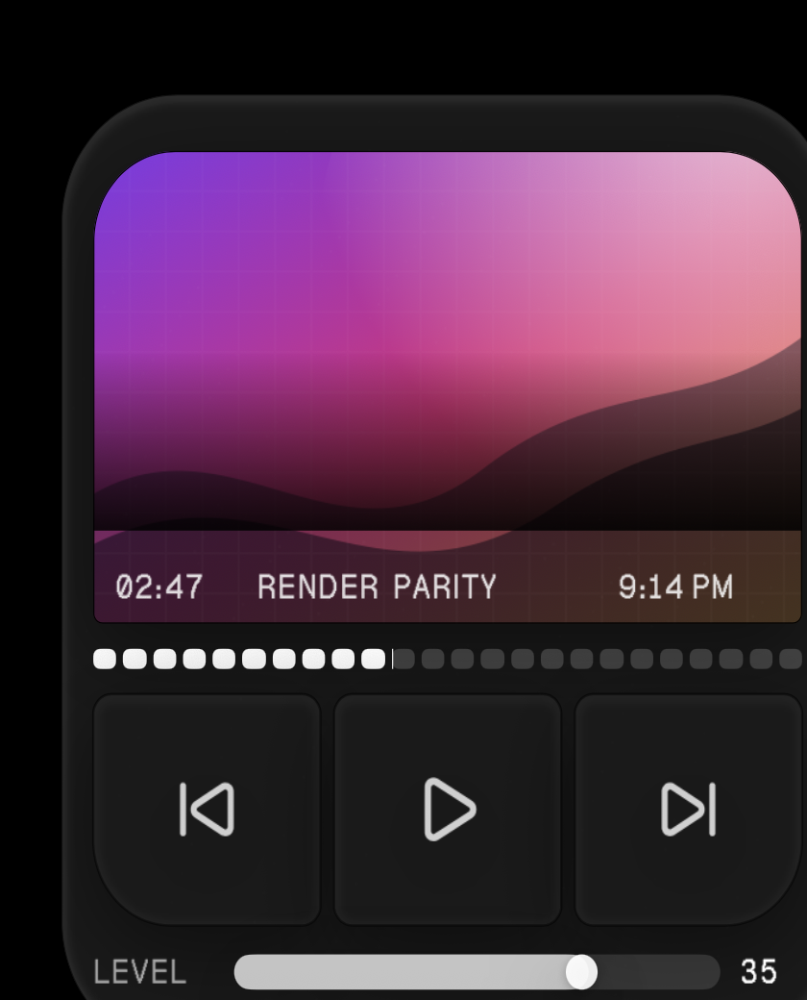

# Weaver-class Widget UI receipt

This receipt verifies Render's native macOS renderer against the UI seams that made Weaver the comparison target. The fixture is [`examples/weaver-parity`](../examples/weaver-parity) and uses only the public Render SDK boundary.



## Verified surface

- deterministic local SVG artwork with cover fitting
- a declared and registered local font
- the pinned Lucide icon catalog used by Weaver
- gradients, grain and grid textures, clipping, asymmetric radii, borders, and ordered inset/outset shadows
- aligned and tracked text with tabular numbers
- live host-local time through the declared `system.time` provider
- native buttons with hover, pressed, focus, disabled, cursor, and descendant appearance contracts
- a persistent native slider whose displayed value follows host-owned state, plus segmented progress
- last-known-good promotion through the normal `render run` lifecycle

The fixture uses explicit point dimensions inside its fixed 340 × 380 design canvas. That is the deterministic receipt for this surface. The SDK also validates `fill`, percentage, fraction, wrapping, and flex descriptors; exact browser-CSS responsive layout equivalence is not claimed by this receipt.

## Verification

Run from the repository root:

```sh
npm run typecheck
npm test
swift test
node bin/render.mjs check --json --workspace examples/weaver-parity
```

For physical verification, copy the example to an isolated workspace and run it through the native lifecycle so repository state remains clean:

```sh
node bin/render.mjs run --json --workspace /path/to/isolated/weaver-parity
```

The captured run promoted a last-known-good snapshot and reported its worker ready. The screenshot is cropped to the Widget surface and contains no desktop or workspace data.
